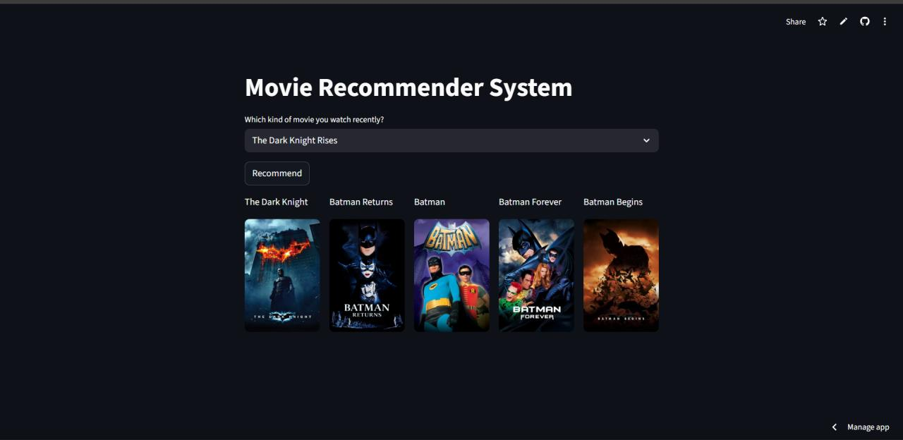
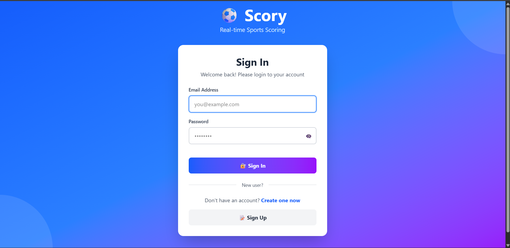
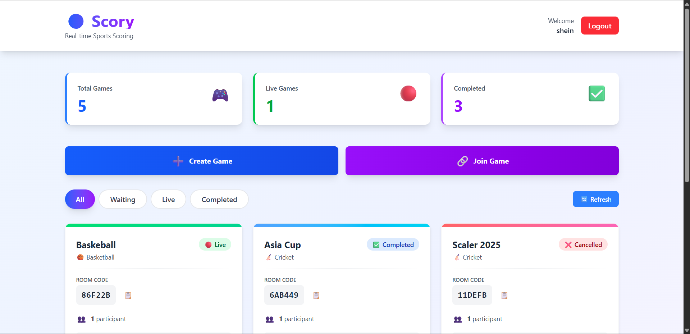

# Projects

---

## Movie Recommender System

[GitHub](https://github.com/ashu273k/Movie-Recommender)
  [Live link](https://movie-recommender-nphjuut2nudddyb6o8uqpk.streamlit.app/)

{width=500}

- Built content-based recommender using TF-IDF and cosine similarity
- Developed preprocessing and evaluation pipelines
- Improved recommendation accuracy through feature engineering

---

## Building my own Claude Code
[Github](https://github.com/ashu273k/Building-my-own-Claude-Code)

- Agent can read file
- Agent can write code/md-file for us
- Agent can execute the bash command

---

## E-Commerce Backend (Spring Boot)

[GitHub](https://github.com/ashu273k/E-Commerece)

- Built REST APIs for product, cart, order, and user management
- Integrated MySQL with JPA/Hibernate
- Implemented JWT authentication & centralized exception handling

---

## Scory — Real-Time Sports Scoring Platform

[GitHub](https://github.com/ashu273k/Scory)

{width=500}

{width=550}

- Built real-time scoring platform using WebSockets, React, Node.js, MongoDB
- Implemented JWT authentication and role-based access control
- Deployed on Vercel & Render with low-latency updates

---

## Multi-Threaded HTTP Server

[GitHub](https://github.com/ashu273k/Multi-threaded-HTTP-server)

- Developed concurrent HTTP/1.1 server using Python thread pooling
- Implemented persistent connections and back-pressure mechanisms
- Added secure file serving, logging, and streaming

---

